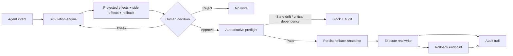

# Architecture Snapshot

## Safety boundary
The simulation is advisory. The preflight is authoritative. Approval never bypasses a failed preflight.

## Data path
Intent → simulation snapshot/fingerprint → human review → live-state re-read → invariant checks → rollback snapshot → destructive write → audit/rollback.
